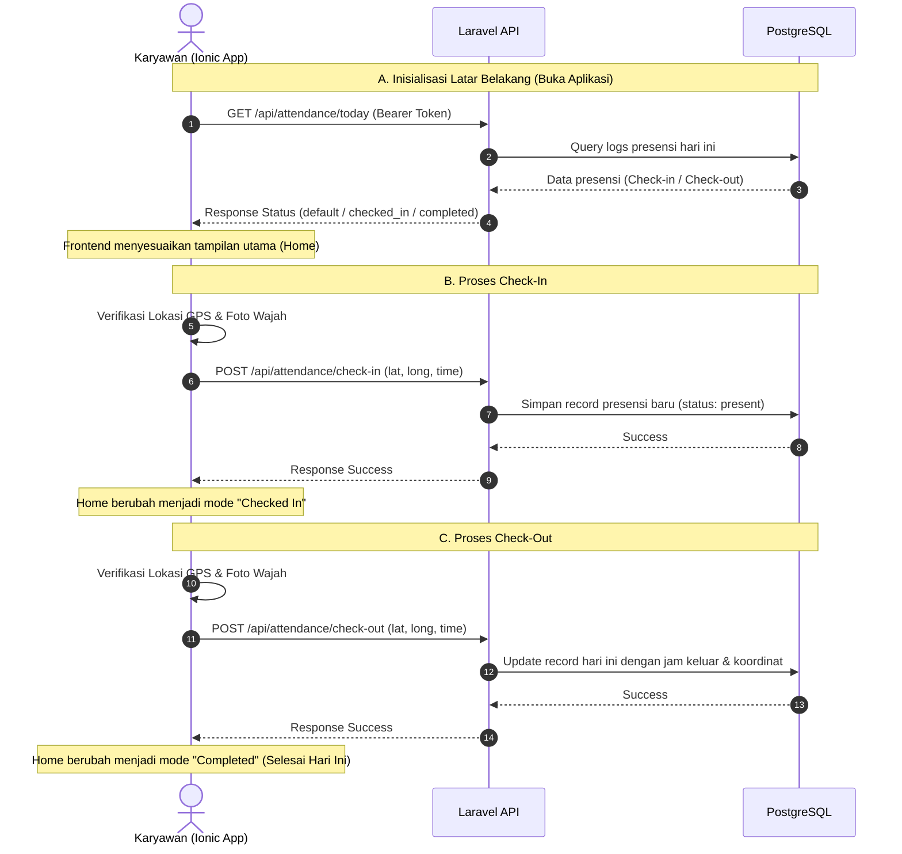

# Roadmap: Integrasi Fitur Presensi (Attendance)

Dokumen ini memuat langkah-barang (checklist) dan alur (flow) pengembangan fitur presensi (Check-in, Check-out, dan Riwayat) untuk menghubungkan Ionic Frontend dengan Laravel Backend.

---

## Alur Data Presensi (Flow Diagram)



---

## Daftar Tugas Pengembangan (Task Checklist)

### 📅 Tahap 1: Persiapan Database & Model (Backend)
- [x] **Buat File Migration `create_attendances_table`**
  - Definisikan kolom: `user_id` (FK), `date` (date), `check_in` (time/timestamp), `check_out` (time/timestamp), `latitude_in`, `longitude_in`, `latitude_out`, `longitude_out`, `status` (string/enum).
- [x] **Jalankan Migrasi Database**
  - Perintah: `php artisan migrate`
- [x] **Buat & Konfigurasi Model `Attendance`**
  - Set atribut `$fillable`.
  - Hubungkan relasi: `Attendance belongsTo User` dan `User hasMany Attendances`.

### ⚡ Tahap 2: Pembuatan API Endpoint (Backend)
- [x] **Buat `AttendanceController`**
  - Perintah: `php artisan make:controller Api/AttendanceController`
- [x] **Implementasikan Fungsi API**
  - `statusToday()`: Mengecek status presensi user saat ini (mengembalikan `default`, `checked_in`, atau `completed`).
  - `checkIn(Request $request)`: Validasi input koordinat GPS, simpan jam masuk saat ini.
  - `checkOut(Request $request)`: Cari data presensi hari ini, update jam keluar dan koordinat GPS keluar.
- [x] **Daftarkan Route API**
  - Buka [api.php](file:///c:/FREELANCE/AbsenNow---Absen-Mudah-Kinerja-Terarah/absen-backend/routes/api.php), tambahkan route di dalam grup `auth:sanctum`:
    ```php
    Route::get('/attendance/today', [AttendanceController::class, 'statusToday']);
    Route::post('/attendance/check-in', [AttendanceController::class, 'checkIn']);
    Route::post('/attendance/check-out', [AttendanceController::class, 'checkOut']);
    ```

### 📱 Tahap 3: Pembuatan Service di Frontend (Ionic)
- [x] **Buat / Edit Service Presensi**
  - Buat file `attendance.service.ts` atau gabungkan ke service state yang ada ([attendance-state.service.ts](file:///c:/FREELANCE/AbsenNow---Absen-Mudah-Kinerja-Terarah/src/app/core/services/attendance-state.service.ts)).
  - Tambahkan fungsi HTTP untuk memanggil API `/attendance/today`, `/attendance/check-in`, dan `/attendance/check-out`.

### 🎨 Tahap 4: Integrasi Halaman UI (Frontend)
- [x] **Sinkronisasi Halaman Utama ([home.page.ts](file:///c:/FREELANCE/AbsenNow---Absen-Mudah-Kinerja-Terarah/src/app/home/home.page.ts))**
  - Panggil API `today` saat inisialisasi halaman untuk memicu state presensi riil dari database.
- [x] **Sinkronisasi Halaman Konfirmasi Sukses ([success.page.ts](file:///c:/FREELANCE/AbsenNow---Absen-Mudah-Kinerja-Terarah/src/app/features/attendance/success/success.page.ts))**
  - Saat mengklik tombol "Go to Home", kirim koordinat GPS tiruan (mock GPS) / GPS HP asli ke backend via API `check-in` atau `check-out` sebelum mengarahkan ke dashboard utama.
